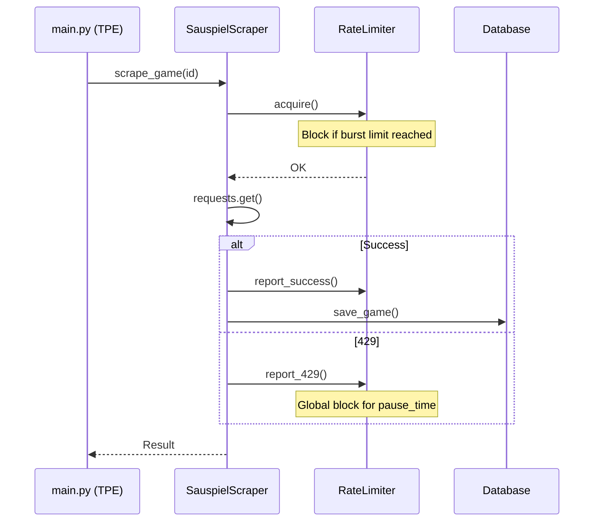

# feat: Parallel and Proactive Rate-Limited Scraper

## Overview
Refactor the `SauspielScraper` to use parallel threads for game details fetching and a proactive `RateLimiter`. This avoids the harsh adaptive penalties currently in place by staying under the server's threshold and waiting for the window reset.

---

## Problem Frame
The current sequential scraper is too slow and reacts poorly to rate limits (429s). It hits a 429 after 20 requests and then applies a persistent exponential backoff. We need to be proactive (pause before the limit) and parallel (fetch multiple games at once), while centralizing state to prevent "thundering herd" 429s.

---

## Requirements Trace
- R1. **Increase Speed:** Use `ThreadPoolExecutor` for concurrent I/O. (AE1)
- R2. **Proactive Throttling:** Implement a `RateLimiter` that pauses before hitting 429. (AE2)
- R3. **Empirical Calibration:** Log timing and success rates to optimize `burst_limit` and `pause_time`. (AE3)
- R4. **Thread Safety:** Ensure `Database`, `SauspielScraper` session/state, and `RateLimiter` are safe for parallel access.

---

## Scope Boundaries
- **Included:** `RateLimiter` class, `SauspielScraper` refactor, `Database` locking, `main.py` parallelization.
- **Excluded:** Proxy rotation, `asyncio`/`httpx` refactor.

---

## Context & Research
### Relevant Code and Patterns
- `src/sauspiel_scraper/core.py`: `_wait_adaptive` and `_adjust_delay` are the targets for refactoring.
- `src/sauspiel_scraper/repository.py`: Needs `threading.Lock` for `save_game`.
- `tests/test_core.py`: Baseline for scraper tests.

---

## Key Technical Decisions
- **Decision:** Centralized 429 Handling in `RateLimiter`.
- **Rationale:** Prevents multiple threads from hitting 429s simultaneously. If any thread reports a 429, the `RateLimiter` must globally block all other `acquire()` calls until the reset window has passed.
- **Decision:** Session Login Lock.
- **Rationale:** Prevents a race condition where multiple threads try to re-login simultaneously when a session expires.

---

## Open Questions
### Resolved During Planning
- **Wait Time:** Start with 60s `pause_time` after 18 requests (`burst_limit`) as a safe baseline.
- **Concurrency:** Start with 5 parallel threads.

### Deferred to Implementation
- **Optimal M:** Finding the shortest possible wait time via calibration logs.

---

## High-Level Technical Design

> *This illustrates the intended approach and is directional guidance for review, not implementation specification. The implementing agent should treat it as context, not code to reproduce.*

---

## Implementation Units

- U1. **Thread-Safe Database**
**Goal:** Prevent SQLite write collisions.
**Requirements:** R4
**Files:**
- Modify: `src/sauspiel_scraper/repository.py`
**Approach:** Add a `threading.Lock` to `Database.__init__` and wrap `save_game` and `create_tables` in it.
**Test scenarios:**
- Happy path: Multiple threads calling `save_game` simultaneously does not crash or lose data.
**Verification:** Unit test with 10 concurrent threads writing to the same file.

- U2. **Global Rate Limiter**
**Goal:** Centralized logic for burst tracking and mandatory pauses.
**Requirements:** R2, R3, R4
**Files:**
- Create: `src/sauspiel_scraper/rate_limiter.py`
**Approach:**
- Use a `threading.Condition` to manage blocking.
- Track `current_burst` and `is_blocked`.
- `acquire()` blocks if `is_blocked` or `current_burst >= burst_limit`.
- `report_429()` sets `is_blocked = True` and starts a timer to reset.
**Test scenarios:**
- Happy path: `acquire()` blocks the 19th call if `burst_limit=18`.
- Atomic: Verify no race condition when 5 threads call `acquire()` at the boundary.
- Jitter: Verify `pause_time` has ±10% variance.
**Verification:** Dedicated `tests/test_rate_limiter.py`.

- U3. **Refactor SauspielScraper for Concurrency**
**Goal:** Make scraper state thread-safe and integrate `RateLimiter`.
**Requirements:** R1, R2, R4
**Files:**
- Modify: `src/sauspiel_scraper/core.py`
**Approach:**
- Add `self._lock = threading.Lock()` for session and re-login logic.
- Replace `_wait_adaptive` and `_adjust_delay` calls with `self.rate_limiter.acquire()` and `report_success/429`.
- Ensure `login()` is wrapped in the lock.
**Test scenarios:**
- Happy path: Multiple `scrape_game` calls share the same `RateLimiter`.
- Error path: Re-login is called only once even if multiple threads detect expiry.
**Verification:** Update `tests/test_core.py`.

- U4. **Parallel Orchestration and Calibration in CLI**
**Goal:** Switch `main.py` to `ThreadPoolExecutor` and add calibration metrics.
**Requirements:** R1, R3
**Files:**
- Modify: `src/sauspiel_scraper/main.py`
**Approach:**
- Use `concurrent.futures.ThreadPoolExecutor`.
- Capture timestamps for every request to calculate "Average Requests Per Minute".
- Log successful/failed requests to the console.
**Test scenarios:**
- Happy path: `ThreadPoolExecutor` correctly collects results from all threads.
- Calibration: Summary prints correct statistics even if some threads fail.
**Verification:** Automated test in `tests/test_main_parallel.py` using `requests-mock`.

---

## System-Wide Impact
- **Interaction graph:** `main.py` -> `ThreadPoolExecutor` -> `SauspielScraper` -> `RateLimiter`.
- **Error propagation:** Threads must catch exceptions and return them to the main thread.
- **Unchanged invariants:** `SauspielScraper.login()` logic remains the same but is now serialized.

---

## Risks & Dependencies
| Risk | Mitigation |
|------|------------|
| Thundering Herd on 429 | `RateLimiter` uses a global `is_blocked` flag set immediately on the first 429. |
| DB Lock contention | SQLite writes are infrequent (1 per second per thread); lock time will be minimal. |

---

## Sources & References
- Origin document: `docs/brainstorms/2026-04-25-efficient-scraping-requirements.md`
- `src/sauspiel_scraper/core.py`
